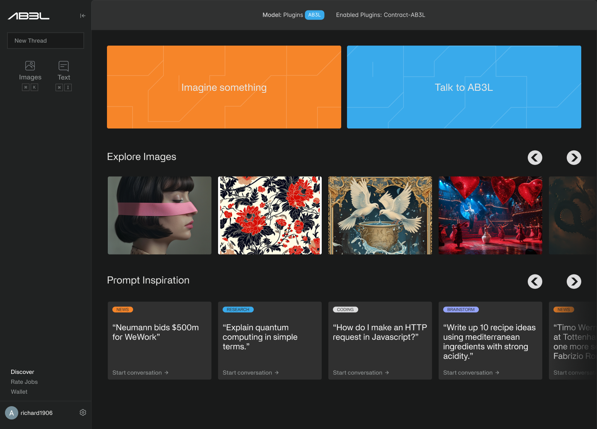

# Blockchain AI Service Demo

This repository contains the front-end code for our blockchain AI service demo. The service includes image generation and LLM services, and it integrates with web3 wallets. The application is built using Next.js.

## Table of Contents
- [Installation](#installation)
- [Usage](#usage)
- [Next.js](#nextjs)
- [Features](#features)
- [Contributing](#contributing)
- [License](#license)

## Installation

1. **Clone the repository:**
   ```sh
   git clone https://github.com/your-repo/blockchain-ai-service-demo.git
   cd blockchain-ai-service-demo
   ```

2. **Install dependencies:**
   ```sh
   npm install
   ```

3. **Set up environment variables:**
   Copy a `.env.example` file to .env file:

## Usage

1. **Start the development server:**
   ```sh
   npm run dev
   ```

2. **Open the application in your browser:**
   The development server will start on `http://localhost:3000`.

## Next.js

Next.js is a React framework that enables functionality such as server-side rendering and static site generation. This application leverages Next.js for its performance benefits and ease of development.

### Running the Application

1. **Development Mode:**
   ```sh
   npm run dev
   ```
   This starts the application in development mode with hot-reloading, error reporting, and more.

2. **Production Mode:**
   To build the application for production, run:
   ```sh
   npm run build
   ```
   This compiles the application and optimizes it for deployment.

3. **Start the Production Server:**
   After building the application, you can start the production server with:
   ```sh
   npm start
   ```

4. **Linting and Formatting:**
   To maintain code quality, use:
   ```sh
   npm run lint
   npm run format
   ```

## Features

### Image Generation
Users can generate images by providing prompts and interacting with the AI model.

### LLM Services
Users can interact with large language models to generate text-based content.

### Web3 Wallet Integration
The application supports connecting with web3 wallets for secure transactions and interactions with the blockchain.

## Screenshots


## Contributing

We welcome contributions! Please read our [Contributing Guide](CONTRIBUTING.md) to get started.

## License

This project is licensed under the MIT License. See the [LICENSE](LICENSE) file for details.
